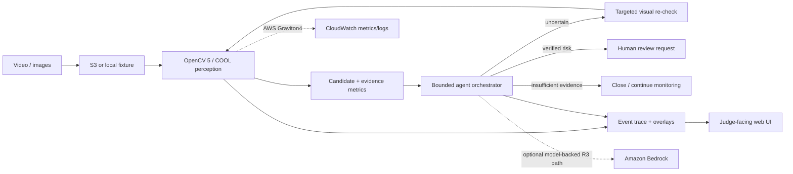

# Architecture v1

## Competition architecture

## Principle

OpenCV 5 is the perception engine, not a thin wrapper. The core workload intentionally contains operations that are both useful to the application and relevant to COOL optimization:

- decode and color conversion;
- resize/pyramid operations where required;
- Gaussian filtering;
- absolute difference/background comparison;
- thresholding;
- morphology;
- connected components and contours;
- geometric crop/ROI operations;
- tracking/temporal verification;
- DNN pre/post-processing when the learned detector is introduced.

## R1 local reference path

`video -> clean-frame reference -> OpenCV change detector -> persistence -> bounded agent -> JSON trace`

The first baseline is deterministic and requires no network service. This establishes a reproducible lower bound for perception and agent behavior before learned detection, AWS, or a model-backed agent is added.

## R3 agent path

The orchestrator exposes explicit visual tools rather than giving a language model raw authority:

- `inspect_frame`
- `inspect_crop`
- `inspect_temporal_window`
- `compare_baseline`
- `verify_track`
- `request_human_review`
- `close_event`

A future Bedrock-backed orchestrator may select among these tools, but the same policy gates remain enforceable outside the model. Human review is required before any consequence is presented as operationally significant.

## AWS deployment target

### Primary path

- **Amazon S3**: input clips, benchmark corpus manifests, generated evidence assets.
- **EC2 Graviton4 (c8g/m8g)**: core application and COOL execution.
- **COOL Graviton4 AMI**: official OpenCV 5 optimized build under `/opt/cool`.
- **CloudWatch**: structured application logs, latency/throughput metrics, failures.
- **Amazon Bedrock (optional R3)**: model-backed orchestration only if it improves measured task success.

The current COOL Marketplace listing provides an Ubuntu 24.04 Arm AMI with OpenCV 5 and preconfigured Python environments. For reproducibility we will record AMI/product version, instance type, region, Python environment, command line, and input corpus hash for each benchmark campaign.

## COOL comparison design

Compare application-relevant work under a frozen harness:

1. same input manifest;
2. vanilla OpenCV 5.0.0 baseline on a comparable Graviton4 instance;
3. COOL OpenCV 5 on Graviton4;
4. fixed warmup and repeated runs;
5. report median and distribution, not one best run;
6. collect end-to-end latency, processed frames/sec, CPU utilization where practical, and effective cost per processed video minute.

Microbenchmarks may explain where speedups come from, but the prize claim will center on the real AeroGuard workload.
